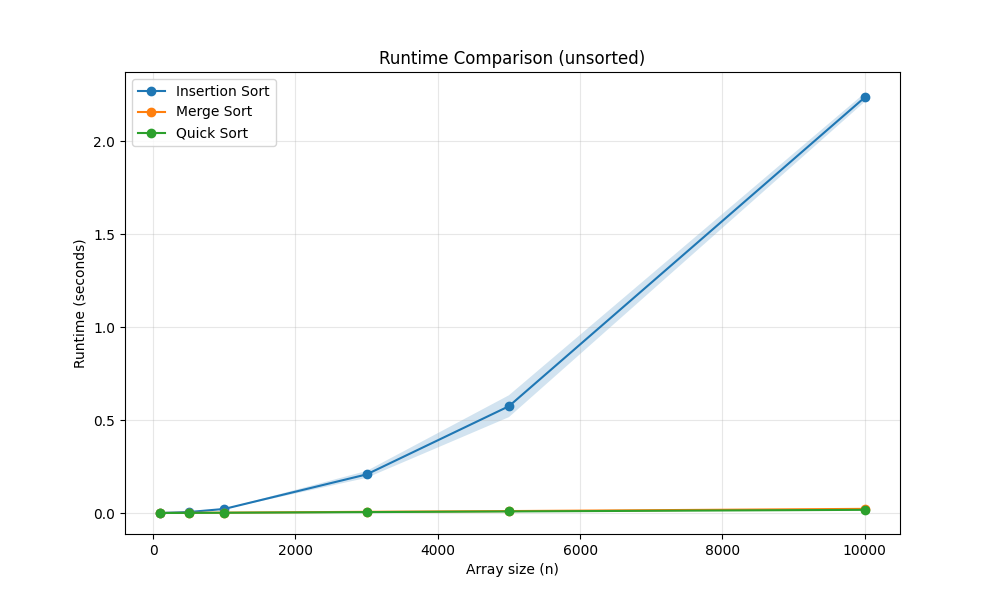
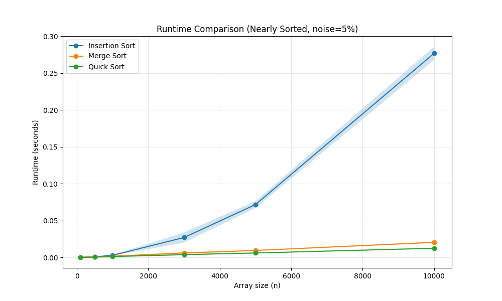

#README FILE

Student name: Roni Dagan

The algorithms that I select is Insertion Sort, Merge Sort and Quick Sort

The experiment was executed using the following command:
python run_experiments.py -a 3 4 5 -s 100 500 1000 3000 5000 10000 -e 1 -r 10
(nearly sorted with 5% noise, and 10 repetitions on each array size)

Insertion SORT have O(N^2) runtime, which means they become extremely slow for large input sizes.
This is why i chose smaller input sizes where it finishes in reasonable time,
and I compare it to the faster algorithms on that shared range.

## Part B –  Comparative Experiment (Random Arrays)

In the figure you can see the result of comparison the running time of 3 sorting algorithms on random arrays of different sizes.
the result are similar to theoretical complexity plots:
- Insertion Sort has average time complexity of O(n²), so the more the size of the array increase also the running time increase.
- merge sort always recursively divides the array into half (for a total of log n levels) and merges each level (an O(n) operation),
  so the running time remain very fast even for larger arrays. time complexity = O(n log n).
- Quick Sort has also time complexity of O(nlog(n)), remain very fast even for larger arrays.

#average running times (array size = 10,000):
Insertion Sort = 2.240 sec
merge sort = 0.018 sec
Quick Sort = 0.018 sec
---

## Part C –  Experiment with Noise (Nearly Sorted Arrays, 5% Noise)

In the figure you can see the result of comparison the running time of the same algorithms on nearly sorted arrays.
the result are again consistent with theoretical expectations:
- Insertion Sort running time is significantly faster compared to the random arrays case for all size of the array.
- Merge Sort and Quick Sort stay with the same time, Quick Sort has a little improvement now when the array Nearly Sorted

#average running times (array size = 10,000):
Insertion Sort = 0.276 sec
merge sort = 0.019 sec
Quick Sort = 0.011 sec
---

#how the running times changed and why
-Insertion Sort running time improved by 2 seconds!! (for array size = 10,000).
 This is because when the array nearly sorted, it requires fewer shifts and comparisons
-Merge Sort does not depend on the initial order of the array, so the running time almost unchanged.  
-Quick Sort is slightly affected by input order, but since the pivot is chosen from the middle of the array, it still performs efficiently.
